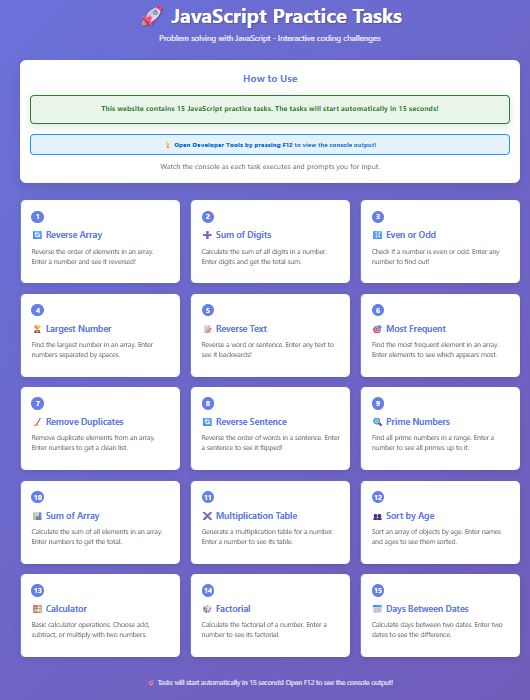

# 🚀 JavaScript Practice Tasks - Interactive Problem Solving

## 📸 Website Preview

<div align="center">



</div>

<div align="center">

> *Modern responsive website featuring 15 interactive JavaScript coding challenges with beautiful UI and automatic task execution*

</div>

---

## 📋 Table of Contents
- [📋 Project Overview](#-project-overview)
- [✨ Features](#-features)
- [🛠️ Technologies Used](#️-technologies-used)
- [📁 Project Structure](#-project-structure)
- [🎨 Design Features](#-design-features)
- [🚀 Getting Started](#-getting-started)
- [📚 Tasks Overview](#-tasks-overview)
- [🎯 Key Features](#-key-features)
- [📱 User Experience](#-user-experience)
- [📄 License](#-license)
- [🌟 Special Thanks](#-special-thanks)

---

## 📋 Project Overview

**JavaScript Practice Tasks** is a modern, interactive website featuring 15 JavaScript coding challenges designed to enhance problem-solving skills. Built with HTML, CSS, and vanilla JavaScript, this project provides an engaging learning experience with automatic task execution and beautiful user interface.

---

## ✨ Features

### 🎯 **Interactive Learning Platform**
- 15 diverse JavaScript coding challenges
- Real-time console output display
- Automatic task execution after 15-second delay
- User-friendly prompts with clear instructions

### 🎨 **Beautiful User Interface**
- Modern gradient background design
- Responsive card-based layout
- Smooth hover animations
- Professional color scheme

### ⏰ **Smart Task Management**
- Automatic countdown before execution
- Clear task descriptions and examples
- F12 Developer Tools integration
- Seamless user experience

### 📱 **Responsive Design**
- Mobile-first approach
- Cross-device compatibility
- Optimized for all screen sizes
- Touch-friendly interface

## 🛠️ Technologies Used

- **HTML5** - Semantic markup and structure
- **CSS3** - Modern styling, animations, and responsive design
- **Vanilla JavaScript** - ES5 syntax for maximum compatibility
- **CSS Grid & Flexbox** - Advanced layout techniques
- **CSS Animations** - Smooth transitions and effects

## 📁 Project Structure

```
AlhussienHazem-Task-7/
├── index.html          # Main website interface
├── script.js           # 15 JavaScript coding tasks
├── README.md           # This file
└── website-showcase.png # Website preview image
```

---

## 🎨 Design Features

- **Gradient Background** - Beautiful purple-blue gradient
- **Card-based Layout** - Clean, organized task presentation
- **Interactive Elements** - Hover effects and smooth transitions
- **Professional Typography** - Clear, readable text hierarchy
- **Color-coded Sections** - Visual organization and emphasis

---

## 🚀 Getting Started

1. **Clone the repository**
   ```bash
   git clone https://github.com/alhussienhazem/javascript-practice-tasks.git
   ```

2. **Navigate to the project directory**
   ```bash
   cd AlhussienHazem-Task-7
   ```

3. **Open in your browser**
   - Open `index.html` in your web browser
   - Press F12 to open Developer Tools
   - Wait 15 seconds for tasks to start automatically

---

## 📚 Tasks Overview

| Task | Description | Input Example | Output Example |
|------|-------------|---------------|----------------|
| 🔄 **1. Reverse Array** | Reverse the order of elements | "123" | "321" |
| ➕ **2. Sum of Digits** | Calculate sum of all digits | "123" | "6" |
| 🔢 **3. Even or Odd** | Check number parity | "7" | "odd" |
| 🏆 **4. Largest Number** | Find maximum in array | "5 2 8 1" | "8" |
| 📝 **5. Reverse Text** | Reverse word/sentence | "hello" | "olleh" |
| 🎯 **6. Most Frequent** | Find most common element | "3 1 3 2 3" | "3" |
| 🧹 **7. Remove Duplicates** | Clean array of duplicates | "1 2 2 3" | "[1, 2, 3]" |
| 🔄 **8. Reverse Sentence** | Reverse word order | "hello world" | "world hello" |
| 🔍 **9. Prime Numbers** | Find primes in range | "10" | "2, 3, 5, 7" |
| 📊 **10. Sum of Array** | Calculate array sum | "[1,2,3]" | "6" |
| ✖️ **11. Multiplication Table** | Generate times table | "5" | "5 * 1 = 5..." |
| 👥 **12. Sort by Age** | Sort objects by age | `[{name:'Ali',age:25}]` | Sorted array |
| 🧮 **13. Calculator** | Basic arithmetic operations | "add 5 3" | "8" |
| 🎲 **14. Factorial** | Calculate factorial | "5" | "120" |
| 📅 **15. Days Between** | Calculate date difference | "2025-01-01 and 2025-01-10" | "9 days" |

---

## 🎯 Key Features

- ✅ **15 Diverse Challenges** - Covers various programming concepts
- ✅ **Interactive Prompts** - Clear instructions with task context
- ✅ **Automatic Execution** - 15-second delay for user preparation
- ✅ **Console Integration** - F12 Developer Tools required
- ✅ **Responsive Design** - Works on all devices
- ✅ **Modern UI/UX** - Professional appearance and animations
- ✅ **ES5 Compatibility** - Works in all browsers

---

## 📱 User Experience

### 🎨 **Visual Design**
- **Beautiful gradient background** - Purple to blue transition
- **Task cards** - Each challenge in its own styled container
- **Hover effects** - Interactive feedback on user actions
- **Color coding** - Green countdown, blue F12 tip, white cards

### ⏰ **Task Flow**
1. **Website loads** - Beautiful interface with task descriptions
2. **15-second countdown** - User prepares and opens F12
3. **Tasks execute** - JavaScript challenges run automatically
4. **Interactive prompts** - User inputs data for each task
5. **Console output** - Results displayed in Developer Tools

### 🎯 **Learning Benefits**
- **Problem-solving skills** - Various algorithm challenges
- **JavaScript fundamentals** - Arrays, loops, conditionals
- **User input handling** - Prompt and data processing
- **Console debugging** - Developer Tools experience

---

## 📄 License

This project is licensed under the MIT License - see the [LICENSE](LICENSE) file for details.

---

## 🌟 Special Thanks

- **Instructor Badr** - For assigning this comprehensive JavaScript practice task
- **Modern web standards** - For enabling responsive design
- **Browser Developer Tools** - For console integration
- **CSS Grid & Flexbox** - For advanced layout capabilities

---

*Built with ❤️ for learning JavaScript problem-solving and web development skills*
